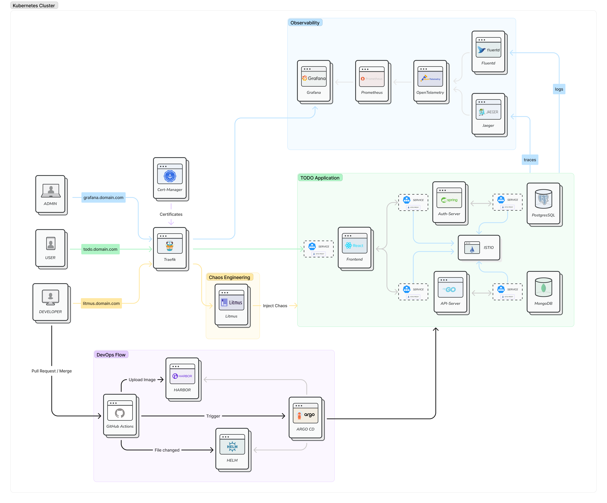
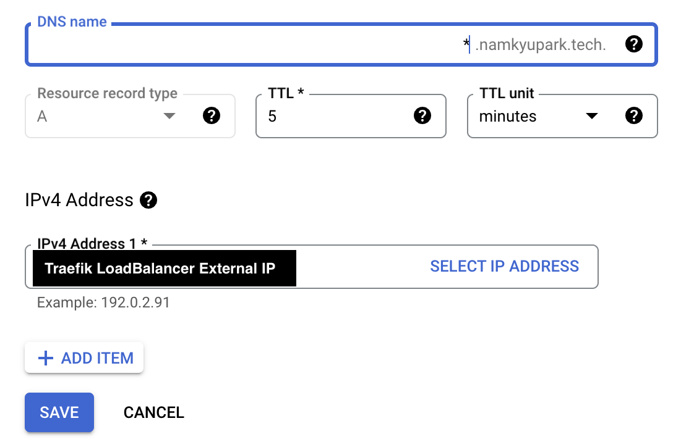

# Hello 👋 Microservices
A TODO application with a microservice architecture.

## Demo
- **TODO application -> https://todo.namkyupark.tech**
- **ArgoCD UI Dashboard -> https://argocd.namkyupark.tech**
- **Traefik UI Dashboard -> https://traefik.namkyupark.tech/dashboard/#/**


## Architecture Diagram

## Prerequisites
- buy your domain
- create your GCP project
- install helm, argocd cli tools

## How to start
1. complete prerequisites
2. setup Kubernetes Cluster
3. install ArgoCD
    ```shell
    # quick start guide: https://argo-cd.readthedocs.io/en/stable/
    kubectl create namespace argocd
    kubectl apply -n argocd -f https://raw.githubusercontent.com/argoproj/argo-cd/stable/manifests/install.yaml
    ```
4. install traefik
    ```shell
    cd ./installation/01-traefik
    helm install traefik . -n traefik-system --create-namespace
    ```
5. buy domain name & setup Cloud DNS
   > set 'A record' to traefik external IP
   
6. Access to ArgoCD UI
   ```shell
   # access to ArgoCD UI via https://argocd.your.domain
   # setup user
   kubectl edit configmap argocd-cm -n argocd
   # data:
   #   accounts.username: apiKey, login
   argocd account update-password \
    --account username \
    --current-password admin-password \
    --new-password new-password
   ```
7. install cert-manager
   ```shell
   kubectl apply -f https://github.com/cert-manager/cert-manager/releases/download/v1.12.0/cert-manager.yaml
   ```
8. deploy application by ArgoCD
    ```shell
    # Deployed by ArgoCD
    ```

## Reference
1. [setup GKE](https://cloud.google.com/sdk/gcloud/reference/container/clusters/create)
2. [setup traefik with cert-manager](https://www.padok.fr/en/blog/traefik-kubernetes-certmanager#access)